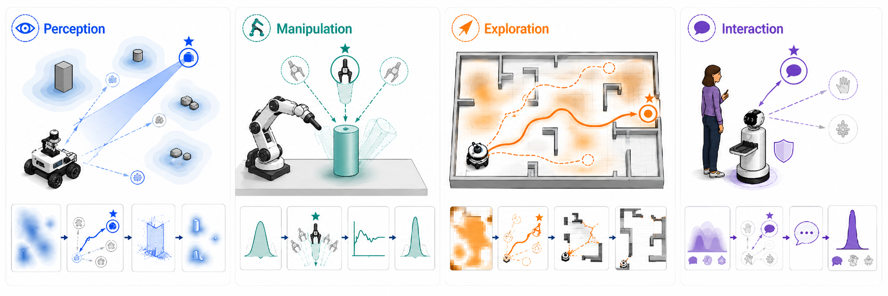

<h1 align="center">Quasi-Optimal Experimental Design (QOED)</h1>

<p align="center">
  <strong>Learning What Matters: Adaptive Information-Theoretic Objectives for Robot Exploration</strong>
</p>

<p align="center">
  <a href="https://roboticsconference.org"></a>
  <a href="https://www.youwei-yu.com/qoed"></a>
  <a href="https://arxiv.org/abs/2605.12084"></a>
</p>



## Installation

Install the base package. You can run [Experiment 1](#experiment-1-quick-demos-of-jackal-and-franka) after this step.

```bash
conda create -n qoed python=3.11 -y
conda activate qoed
conda install conda-forge::uv -y
uv pip install -e . --no-cache-dir
```

Install the [MJLab](https://github.com/mujocolab/mjlab) and [RWM](https://github.com/leggedrobotics/robotic_world_model) dependencies. You can run [Experiment 2](#experiment-2-model-based-policy-optimization) after this step.

```bash
uv pip install -e ".[mjlab]" --reinstall-package warp-lang --no-cache-dir
uv pip install --group rwm --no-deps --reinstall-package rsl-rl-lib --reinstall-package mbrl --no-cache-dir
```

## Experiment 1. Quick Demos of Jackal and Franka

> [!IMPORTANT]
> Requires VRAM >= 1GB

```bash
qoed-jackal-demo --device cuda:0 --sweep
```

```bash
qoed-franka-demo --device cuda:0 --sweep
```

## Experiment 2. Model-based Policy Optimization

> [!IMPORTANT]
> Requires VRAM >= 12GB

#### 2.1 Pretrain in Simulation

Optional: train the dynamics model and policy. A pretrained checkpoint is provided under `logs/`.

```bash
python mbpo/rsl_rl/train.py --task go1 --mode pretrain --domain_randomization --gpu-ids "[0, ]" --headless
```

Optional: play the pretrained policy in MuJoCo.

```bash
python mbpo/rsl_rl/play.py --task go1 --mode pretrain --gpu-ids "[0, ]" --viewer auto
```

#### 2.2 Online Learning

Run real-world online RL, using MuJoCo as the real-system proxy.

```bash
python mbpo/rsl_rl/train.py --task go1 --mode finetune --info-gain qoed --gpu-ids "[0, ]" --viewer auto
```

Available info-gain modes: `qoed`, `qoed-agnostic`, `boed`, and `nothing`.

## Roadmap

- [x] RSS experiments: Jackal, Franka, Go1-Quadruped
- [ ] Code optimization, e.g., torch.compile() or JAX
- [ ] Additional demos, e.g., next-best-view or differentiable MPC
- [ ] Additional robot platforms, e.g., G1-Humanoid, Inspire-Hand

## Miscell
Please consider cite our work if it is interesting.
```
@inproceedings{yu2026qoed,
    author    = {Youwei Yu and Jionghao Wang and Zhengming Yu and Wenping Wang and Lantao Liu},
    title     = {{Learning What Matters: Adaptive Information Theoretic Objectives for Robot Exploration}},
    booktitle = {Proceedings of Robotics: Science and Systems},
    year      = {2026},
    address   = {Sydney, Australia},
    month     = {July}
}
```
